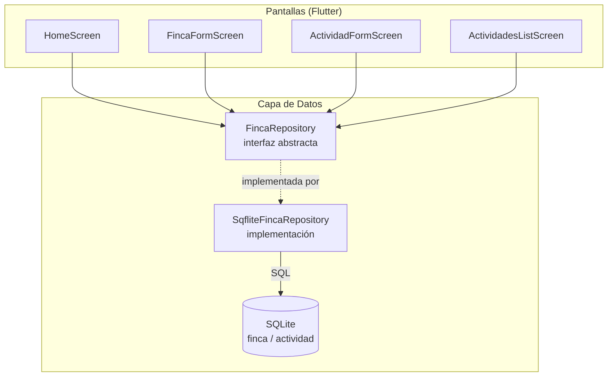

# CoffeCrop — Plan de Arquitectura: Gestión de la Finca Cafetera

> Basado en `spec.md` y `constitution.md`. Cubre cómo se implementa técnicamente la Fase 1 de `AGENTS.md`.

## 1. Arquitectura General



**Capas:**
- **Pantallas:** solo UI y manejo de formularios/estado local. No conocen SQL, solo llaman al `FincaRepository`.
- **`FincaRepository` (interfaz):** el contrato ya definido en `spec.md` §5 — así las pantallas no dependen de sqflite directamente (si el día de mañana cambia el motor de datos, solo se reemplaza la implementación).
- **`SqfliteFincaRepository`:** implementación concreta con sqflite y SQL explícito (ver §5).
- **SQLite:** un solo archivo de base de datos local en el dispositivo.

**Por qué esta separación:** cumple el principio de Single Responsibility de `constitution.md` y permite probar la lógica de negocio (validaciones, cálculo de inversión) sin depender de la UI.

## 2. Justificación del Stack Técnico

| Paquete | Para qué | Aprobación |
|---|---|---|
| `sqflite` | Motor SQLite para Android/iOS | ⚠️ Nueva dependencia — confirmar |
| `path_provider` | Encontrar la carpeta donde guardar el archivo `.db` en el dispositivo | ⚠️ Nueva dependencia — confirmar |
| `uuid` | Generar los IDs únicos de `finca` y `actividad` (spec pide UUID) | ⚠️ Nueva dependencia — confirmar |

Sin paquetes de generación de código (a diferencia de drift) — las consultas son SQL escrito a mano dentro de `SqfliteFincaRepository`, visibles y editables directamente.

**Web fuera de alcance (decisión 2026-09-30):** la app solo se dirige a Android/iOS; `sqflite` encaja perfecto porque no necesita soportar Web. El navegador (`flutter build web`) se sigue usando como atajo de desarrollo para revisar UI, pero sin persistencia real ahí — no requiere ningún paquete adicional para eso.

## 3. Estructura de Carpetas

```
app/lib/
  data/
    db/
      database_helper.dart         # abre/crea la BD, sentencias CREATE TABLE, versión del esquema
    exceptions/
      finca_exceptions.dart        # InvalidFarmDataException, InvalidActivityDataException, NoFincaException
    repositories/
      finca_repository.dart        # interfaz abstracta (contrato de spec.md §5)
      sqflite_finca_repository.dart # implementación concreta con sqflite
  models/
    finca.dart                     # clase Finca (entidad, no widget)
    actividad.dart                 # clase Actividad (entidad, no widget)
  screens/
    home_screen.dart               # existente — se actualiza para leer del repositorio real
    finca_form_screen.dart         # nuevo — US-001
    actividad_form_screen.dart     # nuevo — US-003 y US-005 (crear/editar)
    actividades_list_screen.dart   # nuevo — US-004, listado paginado "Ver todas"
  widgets/
    finca_card.dart                # existente — se actualiza para sacar "Costo por planta" (DEC-006, pendiente)
    actividades_card.dart          # existente
```

## 4. Modelo de Datos (SQLite)

```sql
CREATE TABLE finca (
  id TEXT PRIMARY KEY,
  nombre TEXT NOT NULL,
  numero_plantas INTEGER NOT NULL,
  fecha_creacion TEXT NOT NULL
);

CREATE TABLE actividad (
  id TEXT PRIMARY KEY,
  finca_id TEXT NOT NULL,
  nombre TEXT NOT NULL,
  monto REAL NOT NULL,
  fecha TEXT NOT NULL,
  fecha_creacion TEXT NOT NULL,
  FOREIGN KEY (finca_id) REFERENCES finca(id)
);
```

Coincide exactamente con las tablas de `spec.md` §4. Versión de esquema: `1` (primera versión, sin migraciones todavía).

## 5. Plan de Implementación — consultas SQL por método

Esto es lo que hace `SqfliteFincaRepository` por dentro. Cada método del contrato de `spec.md` se traduce a:

### `obtenerFinca()`
```sql
SELECT * FROM finca LIMIT 1;
```
Como solo hay una finca por instalación (DEC-001), no hace falta filtrar por id — se trae la única fila que existe (o ninguna si aún no se creó).

### `guardarFinca(finca)`
```sql
INSERT OR REPLACE INTO finca (id, nombre, numero_plantas, fecha_creacion)
VALUES (?, ?, ?, ?);
```
`INSERT OR REPLACE` porque al ser una sola finca, "guardar" sirve tanto para crearla la primera vez como para editarla después (mismo `id` fijo, generado una sola vez).
Antes de ejecutar, se valida en Dart (no en SQL) nombre y número de plantas según BR-001; si falla, se lanza `InvalidFarmDataException` sin tocar la base de datos.

### `agregarActividad(actividad)`
```sql
-- 1. Verifica que exista una finca (BR-005)
SELECT COUNT(*) FROM finca;
-- si el resultado es 0 → throw NoFincaException, no se ejecuta el INSERT

-- 2. Inserta la actividad
INSERT INTO actividad (id, finca_id, nombre, monto, fecha, fecha_creacion)
VALUES (?, ?, ?, ?, ?, ?);
```
Antes del INSERT, se valida nombre/monto/fecha según BR-003 (`InvalidActivityDataException` si falla).

### `listarActividades({required pagina})`
```sql
SELECT * FROM actividad
ORDER BY fecha DESC
LIMIT 20 OFFSET ?;  -- offset = pagina * 20
```
Tamaño de página fijo en 20 (DEC-004). `pagina` arranca en 0.

### `actualizarActividad(actividad)`
```sql
UPDATE actividad
SET nombre = ?, monto = ?, fecha = ?
WHERE id = ?;
```
Misma validación BR-003 antes de ejecutar.

### `eliminarActividad(id)`
```sql
DELETE FROM actividad WHERE id = ?;
```
Precedido de un diálogo de confirmación en la UI (US-005), no en el repositorio.

### `calcularInversionTotal()`
```sql
SELECT COALESCE(SUM(monto), 0) AS total FROM actividad;
```
`COALESCE` evita que devuelva `NULL` cuando todavía no hay actividades (devuelve `0`).

### Actualización de la UI tras escribir (BR-004)
Como no usamos drift (sin streams automáticos), el patrón es: **después de cada escritura exitosa** (`agregarActividad`, `actualizarActividad`, `eliminarActividad`), la pantalla vuelve a llamar a `calcularInversionTotal()` y `listarActividades()` y hace `setState`. Es más manual que con drift, pero no agrega ninguna dependencia nueva de manejo de estado — coherente con la preferencia de mantenerlo simple.

## 6. Estrategia de Pruebas

- **Unidad — validadores:** casos válidos/inválidos de BR-001 (finca) y BR-003 (actividad): nombre vacío/muy largo, número de plantas ≤ 0, monto negativo, fecha futura.
- **Unidad — repositorio:** usando una base de datos sqflite en memoria (`inMemoryDatabasePath`) para no tocar el dispositivo real:
  - `agregarActividad` sin finca creada → lanza `NoFincaException` (BR-005).
  - `calcularInversionTotal` con 0, 1 y varias actividades (incluye el caso `COALESCE` con tabla vacía).
  - `listarActividades` con paginación: pedir página 0 y página 1 con 25 actividades de prueba, verificar que trae 20 y 5 respectivamente, en orden por fecha descendente.
  - Editar/eliminar una actividad y verificar que `calcularInversionTotal` refleja el cambio (BR-004).
- **Patrón:** AAA (Arrange, Act, Assert) por cada test, según `constitution.md`.
- **Mocking:** no hace falta mockear la base de datos en sí (se usa sqflite en memoria, más realista que un mock), pero si se agrega lógica que dependa del repositorio desde la UI, el repositorio se mockea con una implementación falsa de `FincaRepository`.

## 7. Supuestos a Validar

1. **IDs:** se generan con el paquete `uuid` (v4, aleatorio) en el momento de crear el objeto en Dart, no en SQLite (SQLite no genera UUIDs nativamente).
2. **Fechas:** se guardan como texto ISO-8601 (`TEXT`), no como tipo nativo de fecha (SQLite no tiene uno) — coincide con `spec.md` §4.
3. **No hay versión de "editar número de plantas de la finca" como flujo separado** — se asume que `guardarFinca` cubre tanto crear como editar (mismo formulario, ver DEC-001/DEC-002 en `spec.md`).
